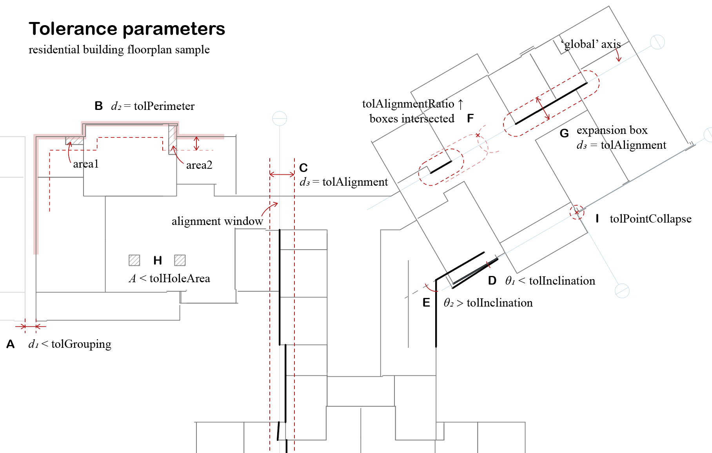

Interface
=========

Tolerance Parameters
--------------------

There are several tolerance parameters customizable. Because architecture design has some modals by convention, often the case is, you do not need to change these values.

* ``tolGrouping`` 
   Edges with distance below this threshold will be grouped together. Each edge group represents a building block, or several adjacent, simply connected regions, depending their containment relationship with each other. (0.1 ~ 0.5 m) 
* ``tolPerimeter`` 
   During regeneration, the floorplan boundary will be offset inward with this distance to create a perimeter area. All edges and points within this area will be pulled onto the floorplan boundary to omit minor gaps. (0.1 ~ 1 m)
* ``tolAlignment`` 
   All "almost" parallel lines within this movable window (width = tolAlignment) will be grouped together to generate one axis. Then, they will be projected onto that axis for alignment. (0.1 ~ 0.4 m )
* ``tolInclination`` 
   The algorithm will check all directions of edges and find out the main axes. Those directions with angle in between smaller than this threshold will be ignored, as modeling deficiency. (0.01~0.1 rad)
* tolAlignmentRatio (hidden)
* tolPointCollapse (hidden)
* tolHoleArea (hidden)
* tolDouble (hidden)

   Tolerance Parameters

Each scenario depicted:

**A** - The residential building has two building blocks, the east wing, and the west wing. There is a d = 0.45 m gap between them (measured by the centerline). If tolGrouping is larger than d, the grouping process will regard them as two isolated building blocks. If tolGrouping is smaller than d, the whole floorplan will be merged as one. There will be a single boundary hull (if successful) encapsulating all edges, with the gap modeled as an interior space.
However, due to no robust algorithm for minimum concave hull for a set of line segments, it usually causes the program to crash when tolGrouping is too large.
Also, tolGrouping is used for detecting inner holes of multiply connected regions (MCR). If it is larger than the width of circulation aisles (no one will set it as big as 2 m right?), the inner holes will be gone during the polygon detection process.
You need to tune the value to suit your case. Usually, 0.5 m is safe to mend the gap of the expansion joint or filter out the inner holes of MCR.

**B** - There might be structure gaps between inner partitions/floors and building facades, especially when a curtain wall system exists. For underground buildings, there might be double walls along the boundary. tolPerimeter is to remove such cavities for clean energy modeling. In this so-called perimeter patch process, the algorithm first offsets the recognized floorplan boundary (pink bold polyline) inward with distance d = tolPerimeter (red dash line), then creates a perimeter belt area by boolean subtraction. All edges or points within the "belt" will be pulled onto the boundary. For example, all edges of area1 are within this region, and it vanishes after this operation. One edge of area 2 is partially included in this region, and the operation can only pull the endpoints along with the edge's direction, thus area2 survives. If you keep tuning up tolPerimeter, area2 will perish as well.
Assuming a common situation where there is a concrete wall behind the glazing facade, the perimeter patch process not only removes the gaps but also overrides the glazing boundary condition by concrete walls, which reflect the actual thermal transmittance. If you wish to keep the buffer zone created by this air cavity, just tune down tolPerimeter a bit.

**C** - The alignment of wall centerlines helps to weld up all edges at their breakpoints. Meanwhile, it reduces unnecessary surfaces for simulation speed-up. The process applies a sliding window with fixed width d = tolAlignment. The window frame is greedy to include as many edges (that are "almost co-lined") as possible. All zig-zag edges within the window frame will be projected onto an axis generated based on their positions.

**D** - The "almost co-lined" is determined by tolInclination, which allows a certain angle among the "co-lined" edges. At the beginning of alignment, the algorithm determines some main directions of all edges. Some queer directions (usually due to model deficiency) are overwritten by prevalent ones. These main directions will guide the sweeping process in step **E**, making all edges alignment in the correct grid system.
If θ is larger than tolInclination, like **G**, the algorithm will try to keep these two edges' directions different.

**F** - The distance of two "almost co-lined" edges on their axis direction is also considered by introducing tolAlignmentRatio. The "almost co-lined" edges are further clustered by their distances from each other to create a more "local" axis. Whether to get clustered or not is determined by the intersection relation of their expansion box (refer to **G**). If you wish to align edges more "globally", you can tune up tolAlignmentRatio to make the clustering reach further along the edge direction. In the case of **F**, these two edges are close enough to create a more global axis (the pale blue line). By default, tolAlignmentRatio = 1, and the box expands at the same speed on both edge direction and edge normal. 
I would suggest a local axis and not set tolAlignmentRatio too high.

**H** - A polygon contained by a larger polygon forms a hole inside the multiply connected region. It can be ignored if its area is smaller than tolHoleArea. There are many cases regarding the modeling deficiency, for example, the column modeled by four pieces of walls, a hole in the floorplan that generates unnecessary air wall around it, or a self-intersected space collapses into an MCR with a wedge-like cavity. We will visit more situations and details in the MCR recognition part.
In this case, these two squares will be erased.

**I** - A point collapse process is applied at the end of edge alignment, where all edge endpoints within the range will be pulled onto the axis intersections (and the edge, if possible). tolPointCollapse determines the radius. It may increase the robustness of the alignment process, however, too large tolerance may cause chaos beyond imagination.