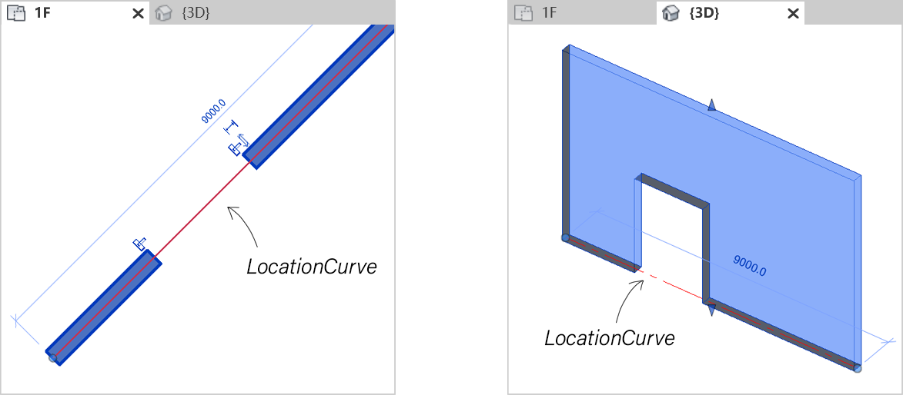
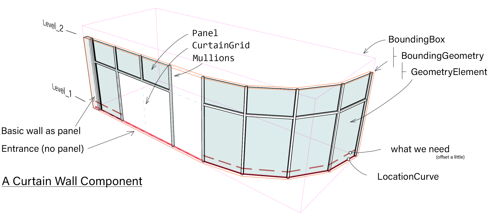
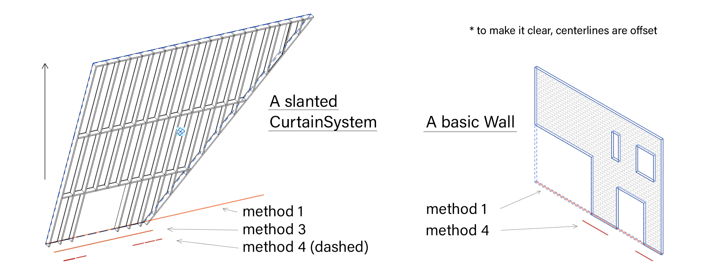

Wall Centerline
===============

The question is, how to get the location curve of any enclosing components like basic/stacked/curtain wall and the curtain system? Imaging processing a badly modeled .rvt and we want to get the exact space boundary, for volume generation, collision detection or some routing algorithms. :py:func:`get_PlanTopology()` is sweet for detecting plan circuits in a generated floorplan view. However, it applies global tolerance and may overflow through gaps (yes, it is a defective model).

Snippets overview:

#. :ref:`Filter Wall and get the LocationCurve <snippet-1>`
#. :ref:`Get the top/bottom limits of a wall by GetBoundingBox() <snippet-2>`
#. :ref:`Perform intersection between Solid and Plane <snippet-3>`
#. :ref:`Perform intersection between Wall geometries and Plane <snippet-4>`
#. :ref:`Get intersection points between CurtainGrid and Plane <snippet-5>`
#. :ref:`Get Panel geometries of Curtain and Curtain System <snippet-6>`
#. :ref:`Filter CurtainSystem <snippet-7>`
#. :ref:`Get horizontal/vertical grid lines (boundary included) <snippet-8>`

Basic/Stacked Wall
------------------

So, I plan to get the location curve of all enclosing components at each floor. Luckily, we have ``LocationCurve`` attribute. As to a Wall, it is the Location Line at its bottom face. For a Family Instance like Column, it usually lies at its central axis. It can be a Line or an Arc. The basic method to retrieve it is like: (let's say we filter all walls in the Revit document)

.. _snippet-1:

.. code-block:: csharp

    // snippet-1
    // ExternalCommandData commandData
    Document doc = commandData.Application.Document;

    IList<Element> _eWalls = new FilteredElementCollector(doc)
        .OfClass(typeof(Wall))
        .OfCategory(BuiltInCategory.OST_Walls)
        .ToElement();
    foreach (ELement e in _eWalls)
    {
        Wall wall = e as Wall;
        LocationCurve lc = wall.Location as LocationCurve;
        if (lc.Curve is Line)
            // do something like adding the line to your collection
        else
            List<XYZ> pts = new List<XYZ>(lc.Curve.Tessellate());
            // here I shatter the curve into multiple segments
    }

A minor flaw is that, the location curve lies at the bottom of the wall component. If encountered with a wall spanning multiple floors, like 1-5, I can only get the enclosing boundary at 1 floor not including all others above. Apparently, a workaround is to compare the elevation of wall and all levels: (though seems too dumb)

.. _snippet-2:

.. code-block:: csharp

    // snippet-2
    // presume we have LevelId lvId, Wall wall
    Level level = doc.GetElement(lvId) as Level;

    Options op = wall.Document.Application.Create.NewGeometryOptions();
    op.IncludeNonVisibleObjects = false;
    GeometryElement ge = wall.get_Geometry(op);

    double top = ge.GetBoundingBox().Max.Z;
    double bottom = ge.GetBoundingBox().Min.Z;
    double elev = level.Elevation;
    // then check if elev lies within the span of top and bottom

``IncludeNonVisibleObjects`` is a critical setting. Sometimes a wall is not what it looks like. A wall on the ground floor may have some component invisible or grid on the 5th floor, especially the case of curtains. As to a defective model, there are lots of nasty stuffs swept to the hidden layer.

The ``GetBoundingBox()`` is a shortcut. It is not gonna work when facing a wall that has multiple isolated geometry components. A typical case is the punctuated wall like this. The location curve should break at the hole, which means it must be the intersection between the floor plane and the actual geometry of walls.

   A wall with holes

  
We need Boolean operations for solid and plane intersection. Two routes:
1. RevitAPI provides ``CutWithHalfSpace()`` (`API <https://www.revitapidocs.com/2022/cbde1739-3680-4f2a-8215-a48fd08dcb5c.htm>`_/ `code_1 <https://www.parametriczoo.com/index.php/2020/04/09/plane-and-solid-surface-intersection/>`_ / `code_2 <https://forums.autodesk.com/t5/revit-api-forum/intersect-solid-and-plane/td-p/6945083>`_). Get the intersection plane then reduce it to the location curve.
2. Extract the external face of the wall then perform the intersection with floor plane.

Note that the external face may not be the actual "external" one for this is often wrongly defined in a defective model. I prefer the 1st one by collapsing rectangles to center lines. 

.. _snippet-3:

.. code-block:: csharp

    // snippet-3
    // basic method for solid-plane intersection
    CurveLoop GetSolidPlaneIntersectionCurve(Plane plane, Solid solid)
    {
        if (solid == null) return null;
        Solid cast = BooleanOperationsUtils.CutWithHalfSpace(solid, plane);
        if (cast == null)
        {
            // what if the plane lies exactly on the bottom face of the solid?
            // just reverse the plane and do it again
            cast = BooleanOperationsUtils.CutWithHalfSpace(solid, 
                Plane.CreateByNormalAndOrigin(-plane.Normal, plane.Origin));
            if (cast == null)
                return null;
        }
        PlanarFace cutFace = null;
        foreach (Face face in cast.Faces)
        {
            PlanarFace pf = face as PlanarFace;
            if (pf == null) continue;
            if (pf.FaceNormal.IsAlmostEqualTo(XYZ.BasisZ.negate())) && 
                pf.Origin.Z == plane.Origin.Z)
                cutFace = pf;
        }
        if (cutFace == null) return null;
        CurveLoop boundary = cutFace.GetEdgesAsCurveLoops()[0];
        return boundary;
    }

Code snippet to apply the process to wall location curve extraction. Note that ``WallKind`` attribute is used to discriminate curtain walls, which has four enumerates: ``Basic`` ``Curtain`` ``Stacked`` ``Unknown``

.. _snippet-4:

.. code-block:: csharp

    // snippet-4
    // continue from snippet-2
    List<Solid> solids = new List<Solid>() { };
    List<CurveLoop> sectionBounds = new List<CurveLoop>() { };
    // take Z-0 plane for example
    Plane plane = Plane.CreateByNormalAndOrigin(XYZ.BasisZ, new XYZ());

    foreach (GeometryObject obj in ge)
    {
        if (obj is Solid)
        {
            Solid solid = obj as Solid;
            if (solid != null) solids.Add(solid);
        }
        // unpack again if there is another instance
        else if (obj is GeometryInstance)
        {
            GeometryInstance _gi = obj as GeometryInstance;
            GeometryElement _ge = _gi.GetInstanceGeometry();
            foreach (GeometryObject _obj in _ge)
            {
                if (_obj is Solid)
                {
                    Solid solid = _obj as Solid;
                    if (solid != null) solids.Add(solid);
                }
            }
        }
    }

    foreach (Solid solid in solids)
    {
        // skip Solid that has no actual faces and edges
        if (solid.Edges.Size == 0 || solid.Faces.Size == 0) continue;
        sectionBounds.Add(GetSolidPlaneIntersectionCurve(plane, solid));
    }

    // placeholder for CurveLoop-centerlines collapse

Curtain Wall & CurtaSystem
--------------------------

The location line can be read out from `LocaitonCurve` attribute of a curtain wall, same as basic walls. However, a curtain wall component has the same problem as to isolated geometries and missing panels. There exists hierarchical encapsulated geometries and only the basic element represents the actual space boundary. From top level to the bottom:  `BoundingBoxXYZ <https://www.revitapidocs.com/2022/3c452286-57b1-40e2-2795-c90bff1fcec2.htm>`_ > `Bounding Geometry <https://www.rhino3d.com/inside/revit/beta/guides/revit-elements#instance-bounding-geometry>`_ > isolated element part > `CurtainGrid <https://www.revitapidocs.com/2022/5e0d5b7c-aaa1-d299-6fb8-2faa65b1857a.htm>`_ > `Panel <https://www.revitapidocs.com/2022/ad561307-a19c-9a8a-728d-5646e90b451b.htm>`_. For example:

Rhino.Inside includes the concept **Bounding Geometry**. Its best version should be a blob enclosing the solid union of all element geometry inside the component. However, it is just an extrusion from LocationCurve. Source `code <https://github.com/mcneel/rhino.inside-revit/blob/804619c84f86bac37ca051263b35a9e59550e227/src/RhinoInside.Revit.GH/Components/Element/BoundingGeometry.cs>`_ here for reference. Notes from the official document:
> Sometimes it is necessary to extract the Bounding Geometry of an instance. Bounding Geometry is a geometry that wraps the instance geometry as close as possible and generally follows the instance geometry topology. Currently, Bounding Geometry component only works with Walls but will be extended to work with other Revit categories in the future.

   An unusual curtain wall

To this point, let's summarize the methods for the location curve:

======================================================================  ==== ======= ========
Method                                                                  Wall Curtain CurtaSys
======================================================================  ==== ======= ========
LocationCurve attribute -> Curve                                        ✓    ?       ✗ 
Wall -> External Face -> Boolean intersection (X) floor plane           ✓    ✗       ✗
CurtainGrid -> Grid Line -> X floor plane -> Join sections              ✗    ?       ?
Panel -> Solid -> X floor plane -> Centerline collapse                  ✗    ✓       ✓
======================================================================  ==== ======= ========

1. Curtain System does not have ``LocationCurve`` attributes. The location curve is the red solid line not the dashed one in the figure above, which may form extra enclosed spaces.
2. The ``Face`` is retrieved form the ``Solid`` geometry element in a basic wall. The curtain wall and the curtain system do not have such attributes, nor can their bounding element can be calculated.
3. Curtain wall and ``CurtaSystem`` have grid lines. 1, the grid lines include the boundary so the bottom line may be the location curve (solid line). However, for curtain spanning multiple levels, you can only search for the grid line that is closest to the target level, which may not work. 2, we may perform boolean intersections between the vertical grid lines and the floor plane, then connect all section points. Revit does not have methods for Plane-Curve intersections but you can code it yourself, ref: `Plane and Curve intersection <https://www.parametriczoo.com/index.php/2020/03/31/plane-and-curve-intersection/>`_. However, for horizontal plane intersection with lines, you only need to include Z value into the line function. It is practical when gaining the location curve of a curtain system. However, the coverage of a curtain grid may not be the actual enclosing boundary with panels. AND, there are some weird exceptions. See figure 3.
4. Detect the actual boundary (dashed line in figure 2) by boolean intersection between curtain panels and the floor plane.

   Different centerlines for different methods

.. _snippet-5:

.. code-block:: csharp

    // snippet-5 perform intersection between plane and grid lines
    // continue from snippet-1
    Application app = commandData.Application.Application;
    foreach (Element e in _eWalls)
    {
        Wall wall = e as Wall;
        if (wall.WallType.Kind == WallKind.Curtain)
        {
            CurtainGrid cg = wall.CurtainGrid;
            if (cg != null)
            {
                List<Line> lines = GetCurtainGridVerticalLattice(doc, cg);
                // say we have horizontal plane at z = 0
                double z = 0;
                List<XYZ> vertices = new List<XYZ>() { };
                foreach (Line line in lines)
                {
                    XYZ pt1 = line.GetEndPoint(0);
                    XYZ pt2 = line.GetEndPoint(1);
                    if ((pt1.Z - z)*(pt2.Z-z) <= 0)
                    {
                        double xcoord = (z-pt1.Z)/(pt2.Z-pt1.Z)*(pt2.X-pt1.X)+pt1.X;
                        double ycoord = (z-pt1.Z)/(pt2.Z-pt1.Z)*(pt2.Y-pt1.Y)+pt1.Y;
                        vertices.Add(new XYZ(xcoord, ycoord, z))
                    }
                }
                // based on vertices you can create a polyline as the location curve
            }
        }
    }

Please see Appendix for the detailed function ``GetCurtainGridVerticalLattice()``

.. _snippet-6:

.. code-block:: csharp

    // snippet-6 get the geometry of panels of a curtain wall
    // continue from snippet-1
    Application app = commandData.Application.Application;

    foreach (Element e in _eWalls)
    {
        Wall wall = e as Wall;
        if (wall.WallType.Kind == WallKind.Curtain)
        {
            List<Solid> solids = new List<Solid>() { };
            Options ops = app.Create.NewGeometryOptions();
            ops.IncludeNonVisibleObjects = false;

            CurtainGrid cg = wall.CurtainGrid;
            foreach (ElementId id in cg.GetPanelIds())
            {
                Element _e = doc.GetElement(id);
                GeometryElement ge = _e.get_Geometry(ops);
                foreach (GeometryObject obj in ge)
                {
                    // same as snippet-4 processing wall elements
                }
            }
        }
    }

The panels are retrieved from the curtain grid, so the logic of curtain system is the same as curtain. Only this time, you need to filter the curtain system first.

.. _snippet-7:

.. code-block:: csharp

    // snippet-7 get curtain system element
    Selection sel = commandData.Application.ActiveUIDocument.Selection;
    ICollection<ElementId> ids = sel.GetElementIds();
    if (ids.Count != 0)
    {
        foreach (ElementId id in ids)
        {
            Element e = doc.GetElement(id);
            if (e is Wall) { }
            if (e is FamilyInstance) { }
            if (e is CurtainSystem)
            {
                CurtainSystem cs = e as CurtainSystem;
                if (cs != null)
                {
                    foreach (CurtainGrid cg in cs.CurtainGrids)
                    {
                        // same as snippet-6
                    }
                }
            }
        }
    }

    // or you can use filters
    // not the OST name for curtain system is "CurtaSystem"
    IList<Element> eCurtaSys = new FilteredElementCollector(doc)
        .OfCategory(BuiltInCategory.OST_CurtaSystem)
        .ToElements();

Appendix
--------

The ``GetVGridLineIds()`` returns all grid lines except for the ones at the boundary. Usually we need to compensate for those and align them in the right order.

.. _snippet-8:

.. code-block:: csharp

    // snippet-8 get the vertical grid lines of CurtainGrid
    public static List<Line> GetCurtainGridVerticalLattice(Document doc, CurtainGrid cg)
    {
        List<Line> vCluster = new List<Line>();
        List<Line> uCluster = new List<Line>();
        List<XYZ> vStartCluster = new List<XYZ>();
        List<XYZ> vEndCluster = new List<XYZ>();
        List<XYZ> uStartCluster = new List<XYZ>();
        List<XYZ> uEndCluster = new List<XYZ>();

        List<ElementId> vIds = cg.GetVGridLineIds().ToList();
        List<ElementId> uIds = cg.GetUGridLineIds().ToList();
        for (int v = 0; v < vIds.Count; v++)
        {
            CurtainGridLine cgLine = doc.GetElement(vIds[v]) as CurtainGridLine;
            Curve gl = cgLine.FullCurve;
            vCluster.Add(Line.CreateBound(gl.GetEndPoint(0), gl.GetEndPoint(1)));
            vStartCluster.Add(gl.GetEndPoint(0));
            vEndCluster.Add(gl.GetEndPoint(1));
        }
        for (int u = 0; u < uIds.Count; u++)
        {
            CurtainGridLine cgLine = doc.GetElement(uIds[u]) as CurtainGridLine;
            Curve gl = cgLine.FullCurve;
            uCluster.Add(Line.CreateBound(gl.GetEndPoint(0), gl.GetEndPoint(1)));
            uStartCluster.Add(gl.GetEndPoint(0));
            uEndCluster.Add(gl.GetEndPoint(1));
        }
        // get the lower limit
        vStartCluster = vStartCluster.OrderBy(z => z.Z).ToList();
        vEndCluster = vEndCluster.OrderBy(z => z.Z).ToList();
        double upperBound = vEndCluster.Last().Z;
        double lowerBound = vStartCluster[0].Z;
        if (vCluster.Count == 0 || uCluster.Count == 0)
            return vCluster;
        if (uCluster.Count == 1)
        {
            double currentZ = uCluster[0].GetEndPoint(0).Z;
            XYZ basePt = Basic.LineIntersectPlane(vCluster[0].GetEndPoint(0), vCluster[0].GetEndPoint(1), currentZ);
            Transform tf1 = Transform.CreateTranslation(uCluster[0].GetEndPoint(0) - basePt);
            Transform tf2 = Transform.CreateTranslation(uCluster[0].GetEndPoint(1) - basePt);
            vCluster.Insert(0, vCluster[0].CreateTransformed(tf1) as Line);
            vCluster.Add(vCluster[0].CreateTransformed(tf2) as Line);
            return vCluster;
        }
        XYZ pt1 = Basic.LineIntersectPlane(uCluster[0].GetEndPoint(0), uCluster.Last().GetEndPoint(0), lowerBound);
        XYZ pt2 = Basic.LineIntersectPlane(uCluster[0].GetEndPoint(0), uCluster.Last().GetEndPoint(0), upperBound);
        XYZ pt3 = Basic.LineIntersectPlane(uCluster[0].GetEndPoint(1), uCluster.Last().GetEndPoint(1), lowerBound);
        XYZ pt4 = Basic.LineIntersectPlane(uCluster[0].GetEndPoint(1), uCluster.Last().GetEndPoint(1), upperBound);
        vCluster.Insert(0, Line.CreateBound(pt1, pt2));
        vCluster.Add(Line.CreateBound(pt3, pt4));
        return vCluster;
    }
