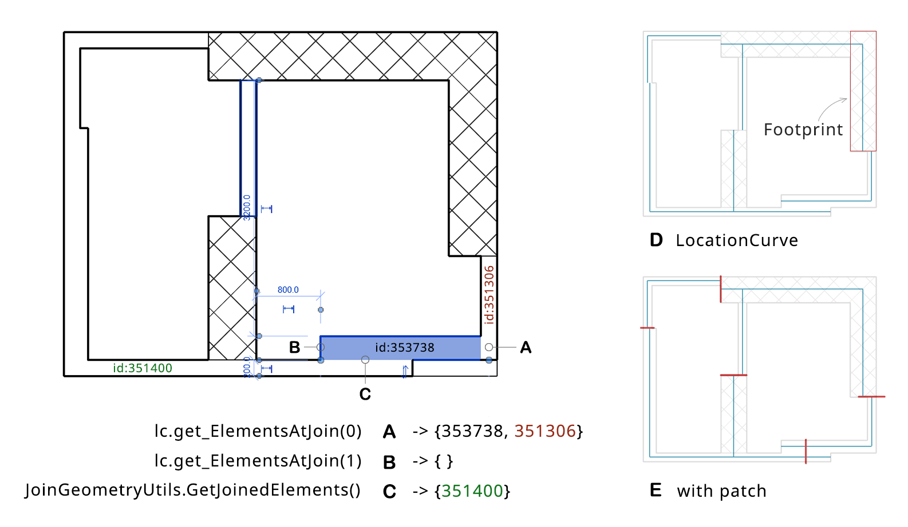

Patch Wall Joint
================

Using location curves of walls to regenerate the space boundary is not a good idea. Usually, they are not connected, and not co-lined with various thickness. Simple alignment can address the issue but they need to get patched at the joints to get more robust.

About how to find the joined elements to walls, Jeremy has explained well in his post: `Getting Two Different Kinds of Joined Elements <https://thebuildingcoder.typepad.com/blog/2014/02/getting-two-different-kinds-of-joined-elements.html>`_. Considering that elements in Revit are auto-joined during modeling, such information may help to rebuild a continuous space boundary (even though the space is leaky)

   Connect wall centerlines

Two methods, ``LocationCurve.get_ElementsAtJoin()`` and ``JoinGeometryUtils.GetJoinedElements()``

Just as Jeremy puts it, ``LocationCurve.get_ElementsAtJoin()`` determines elements joined to the current one at the end of its location curve. In A, the function returns wall 353738 and wall 351306 because they are joined at the start point of the current wall's location curve, yes, it returns the current wall 353738 itself. At the end point, there is no joined connection so it returns an empty array, which is B.

However, wall 351400 is missing out. To get elements that are cut by the current element, ``JoinGeometryUtils.GetJoinedElements()`` is the right way. It returns elements that share a `GeomJoin`, which is a pair-wise cut of geometry from one element to another. It can reveal adjacent walls or columns. In C, it gets wall 351400 correctly.

.. _snippet-1:

.. code-block:: csharp

    // snippet-1
    UIApplication uiapp = commandData.Application;
    UIDocument uidoc = uiapp.ActiveUIDocument;
    Document doc = uidoc.Document;
    // assuming we have a list of walls
    IList<Element> eWalls = new FilteredElementCollector(doc)
        .OfClass(typeof(Wall))
        .OfCategory(BuiltInCategory.OST_Walls)
        .ToElements();

    foreach (Element e in eWalls)
    {
        // method 1
        ICollection<ElementId> eJonedIds = JoinGeometryUtils.GetJoinedElements(doc, e);

        // method 2
        Wall wall = e as Wall;
        LocationCurve lc = wall.Location as LocationCurve;
        ElementArray eAtStart = lc.get_ElementsAtJoin(0);
        ElementArray eAtEnd = lc.get_ElementsAtJoin(1);
    }

**D** Note that the footprint of a wall is the section boundary between it and the level plane, which may include several rectangles if the wall has openings. And, the location curve may not intersect with the footprint because of the joints.

**E** A patch line (red) segment is generated at the joint (or the center point of their overlap/gap) of two joined walls, if they are almost parallel. The length takes the larger thickness.

  
