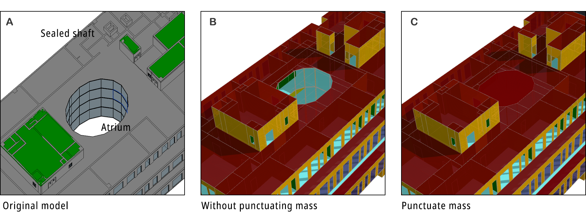

Main Settings
=============

``Create Void``

The plugin will punctuate the building mass if this option is ticked. It checks whether a recognized space is enclosed by any upper roof. If not, the space will be deleted with all its interior boundaries switched to exterior ones. This iterative process keeps deleting spaces qualified until nothing left. Take Revit model **A** for example, **B** is the generated XML when 'Punctuate Mass' is ticked. The hole is cut out at the center. If not ticked, the XML appears to be **C**. Sometimes the ventilation shafts are not sealed at rooftop. Punctuating the mass will make the whole shaft exterior boundary inside the building, leading to higher energy simulation results. However, in case **A**, such shafts are covered by roof panel.

